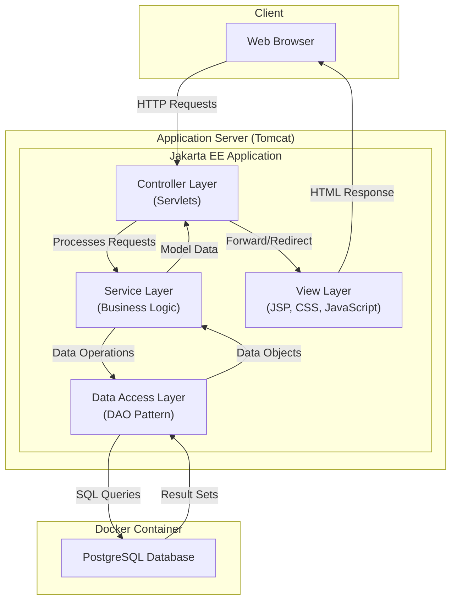
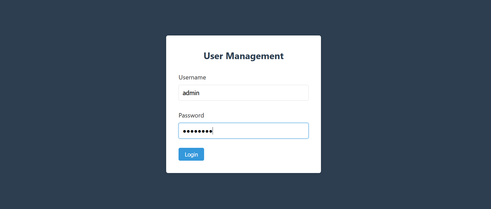
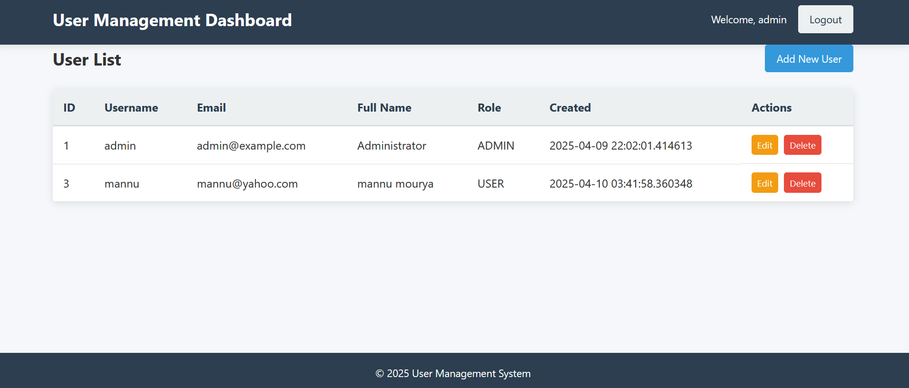

# Jakarta EE User Management Admin Panel


## Overview

This project is a comprehensive User Management Admin Panel built with Jakarta EE (formerly Java EE) and PostgreSQL, containerized with Docker. Developed as part of the Advanced Internet Programming course for the 2nd semester at Chandigarh University, this application demonstrates enterprise-level user management capabilities with a focus on security, maintainability, and modern web development practices.

## Features

- **Complete User Management**: Full CRUD operations for user accounts
- **Secure Authentication**: Robust login system with password hashing and session management
- **Role-based Access Control**: Different permission levels for system users
- **Responsive UI**: Modern interface that works across desktop and mobile devices
- **Containerized Database**: PostgreSQL running in Docker for easy setup and portability
- **MVC Architecture**: Clean separation of concerns for maintainable code

## System Architecture



## Technology Stack

- **Backend**: Jakarta EE 9.1
- **Database**: PostgreSQL 14.5
- **Containerization**: Docker & Docker Compose
- **Server**: Apache Tomcat 10.0.23
- **Build Tool**: Maven 3.8.6
- **Frontend**: JSP, JSTL, CSS3, JavaScript (ES6+)
- **Security**: BCrypt for password hashing

## Project Structure

```
user-management-admin/
├── src/
│   ├── main/
│   │   ├── java/
│   │   │   └── com/
│   │   │       └── adminpanel/
│   │   │           ├── controller/
│   │   │           │   ├── LoginServlet.java
│   │   │           │   ├── LogoutServlet.java
│   │   │           │   └── UserServlet.java
│   │   │           ├── dao/
│   │   │           │   ├── UserDAO.java
│   │   │           │   └── UserDAOImpl.java
│   │   │           ├── model/
│   │   │           │   ├── User.java
│   │   │           │   └── Role.java
│   │   │           └── util/
│   │   │               ├── DatabaseConnectionManager.java
│   │   │               ├── PasswordHasher.java
│   │   │               └── ValidationUtils.java
│   │   ├── resources/
│   │   │   ├── db/
│   │   │   │   └── migration/
│   │   │   └── properties/
│   │   └── webapp/
│   │       ├── WEB-INF/
│   │       ├── css/
│   │       ├── js/
│   │       ├── images/
│   │       └── *.jsp
│   └── test/
│       └── java/
│           └── com/
│               └── adminpanel/
├── docker/
│   ├── docker-compose.yml
│   └── postgres/
│       ├── Dockerfile
│       └── init/
├── pom.xml
└── README.md
```

## Screenshots

### Login Page


### Dashboard



## Installation & Setup

### Prerequisites

- JDK 11 or higher
- Maven 3.6+
- Docker and Docker Compose
- Git

### Steps to Run

1. Clone the repository
   ```bash
   git clone https://github.com/yourusername/jakarta-user-management.git
   cd jakarta-user-management
   ```

2. Start the PostgreSQL database with Docker
   ```bash
   cd docker
   docker-compose up -d
   ```

3. Build the application
   ```bash
   mvn clean package
   ```

4. Deploy the WAR file to Tomcat
   ```bash
   cp target/user-management.war /path/to/tomcat/webapps/
   ```

5. Access the application
   ```
   http://localhost:8080/user-management
   ```

### Default Credentials

- Username: `admin`
- Password: `admin123`

⚠️ *Note: Please change these credentials immediately after first login.*

## Database Schema

```sql
CREATE TABLE roles (
    id SERIAL PRIMARY KEY,
    name VARCHAR(50) NOT NULL UNIQUE,
    description TEXT
);

CREATE TABLE users (
    id SERIAL PRIMARY KEY,
    username VARCHAR(50) NOT NULL UNIQUE,
    email VARCHAR(100) NOT NULL UNIQUE,
    password_hash VARCHAR(255) NOT NULL,
    first_name VARCHAR(50) NOT NULL,
    last_name VARCHAR(50) NOT NULL,
    role_id INTEGER REFERENCES roles(id),
    active BOOLEAN DEFAULT true,
    created_at TIMESTAMP DEFAULT CURRENT_TIMESTAMP,
    last_login TIMESTAMP,
    failed_login_attempts INTEGER DEFAULT 0,
    account_locked BOOLEAN DEFAULT false
);
```

## Development

### Building from Source

```bash
mvn clean install
```

### Running Tests

```bash
mvn test
```

### Docker Commands

```bash
# Start containers
docker-compose up -d

# Stop containers
docker-compose down

# View logs
docker-compose logs -f
```

## API Endpoints

| Endpoint | Method | Description |
|----------|--------|-------------|
| `/login` | POST | Authenticate user |
| `/logout` | GET | End user session |
| `/users` | GET | List all users |
| `/users` | POST | Create new user |
| `/users/{id}` | GET | Get user details |
| `/users/{id}` | PUT | Update user |
| `/users/{id}` | DELETE | Delete/deactivate user |

## Academic Information

- **Course**: Advanced Internet Programming
- **Semester**: 2nd Semester
- **University**: Chandigarh University
- **Year**: 2025

## Future Enhancements

- OAuth 2.0 integration
- Two-factor authentication
- RESTful API for mobile applications
- Comprehensive logging and audit trails
- CI/CD pipeline integration

## Contributing

1. Fork the repository
2. Create your feature branch (`git checkout -b feature/amazing-feature`)
3. Commit your changes (`git commit -m 'Add some amazing feature'`)
4. Push to the branch (`git push origin feature/amazing-feature`)
5. Open a Pull Request

## License

This project is licensed under the MIT License - see the [LICENSE](LICENSE) file for details.

## Acknowledgments

- Jakarta EE Community
- PostgreSQL Development Team
- Docker Community
- All open-source libraries used in this project
- Faculty members at Chandigarh University for their guidance


---

*Last updated: April 10, 2025*
